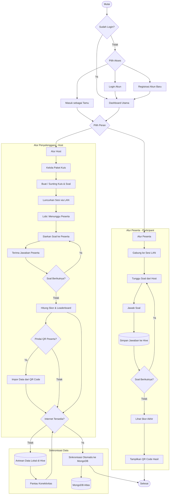
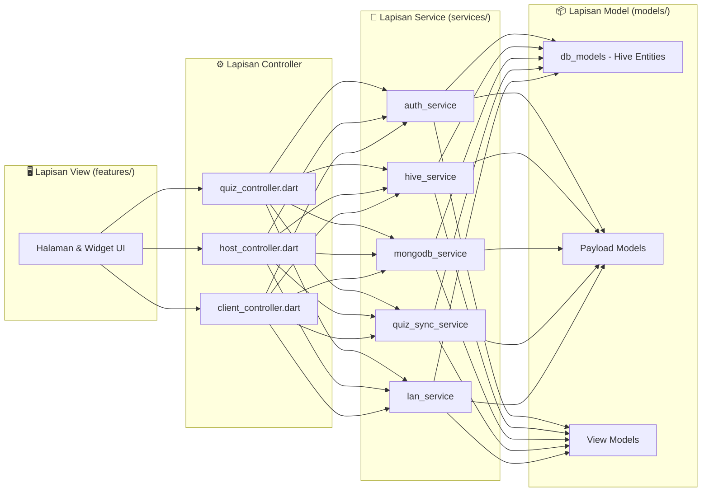
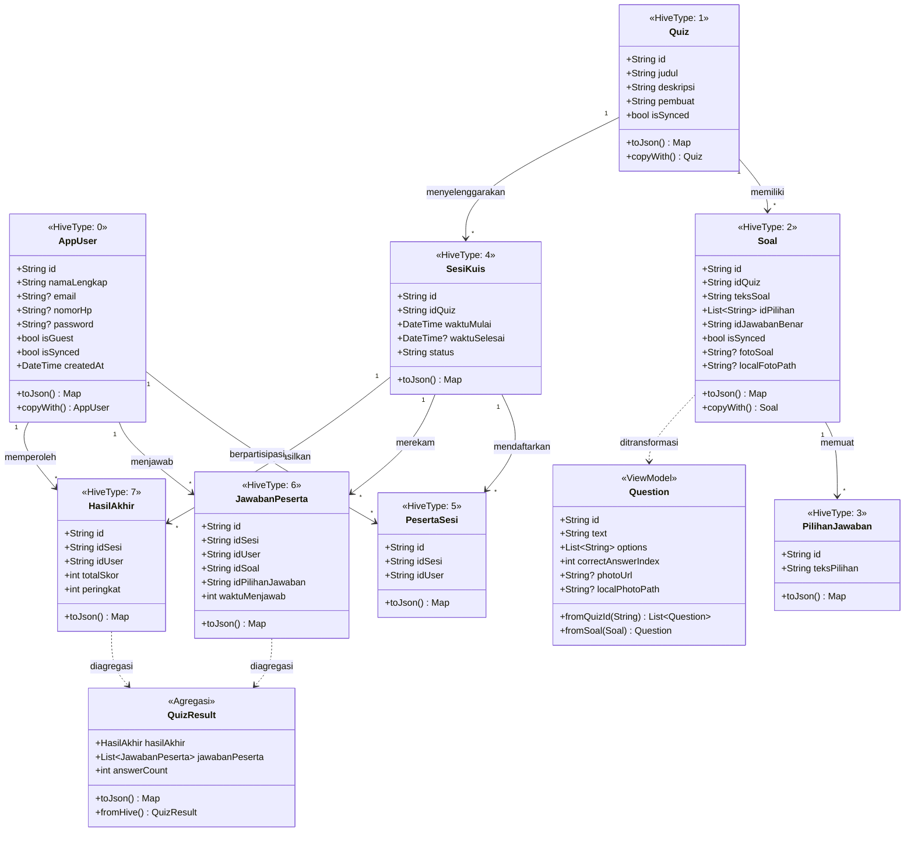
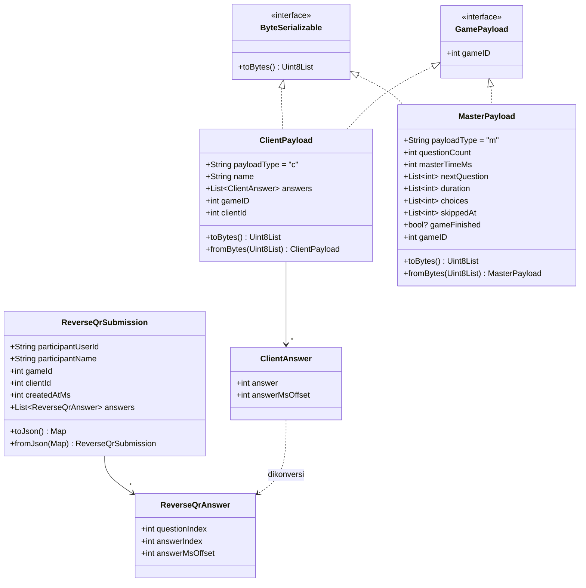
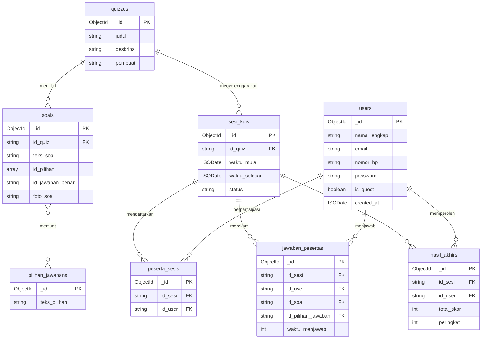
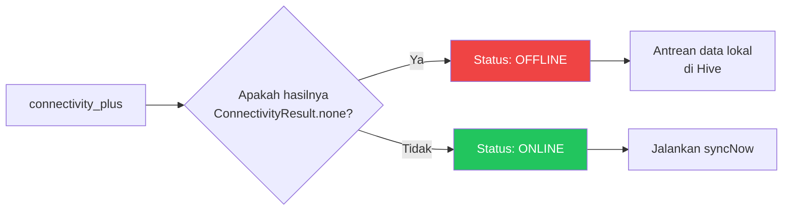
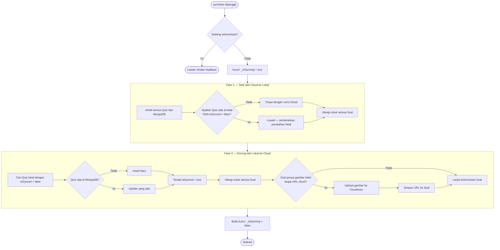
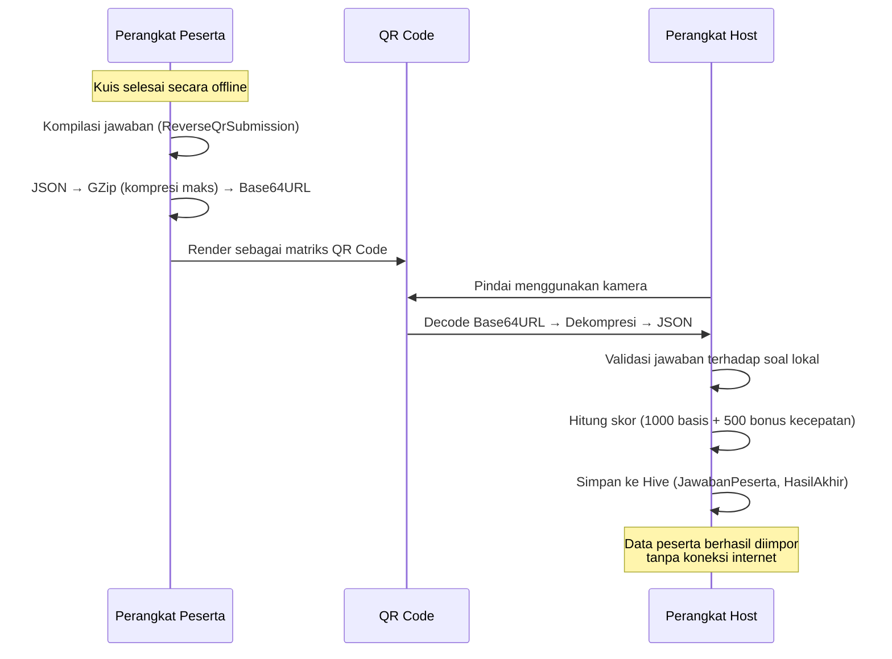
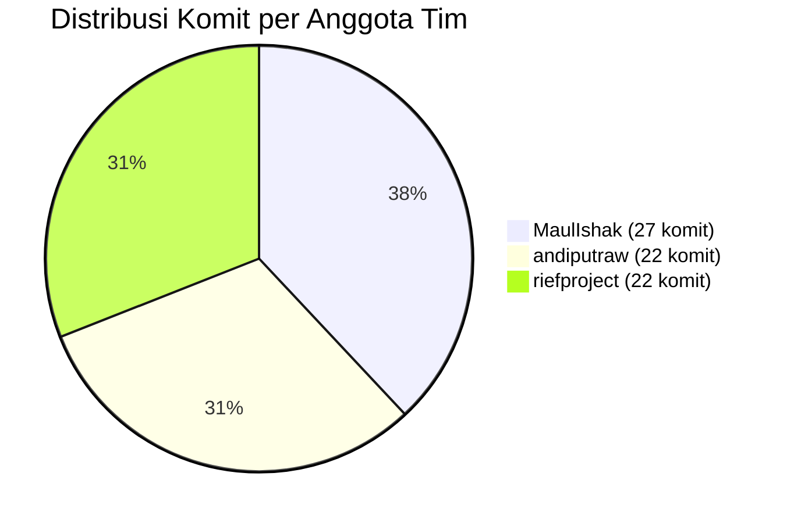

# Laporan Akhir Proyek 4
## Pengembangan Aplikasi Quiz Offline First — AlpenQuiz 🏔️

---

## DAFTAR ISI

| Bagian | Judul |
| :----- | :---- |
| BAB I | Identitas & Workflow Sistem |
| BAB II | Arsitektur Kode & Pemodelan Data |
| BAB III | Implementasi Network Resilience |
| BAB IV | Laporan Pengujian Sistem |
| BAB V | Manajemen Repositori & Integrasi AI |

---

## BAB I — IDENTITAS & WORKFLOW SISTEM

### 1.1 Identitas Tim & Topik

**Nama Aplikasi:** AlpenQuiz
**Repositori:** [github.com/riefproject/quiz-offline-first](https://github.com/riefproject/quiz-offline-first)
**Versi:** 1.0.0+1

**Deskripsi Singkat:**
AlpenQuiz adalah platform kuis interaktif berbasis arsitektur *Offline-First* yang dirancang untuk mengatasi masalah nyata di lingkungan kampus dan acara publik: **ketidakstabilan koneksi internet saat pelaksanaan evaluasi kuis**. Di banyak gedung perkuliahan, area seminar, dan acara lapangan, koneksi jaringan sering kali tidak memadai — menyebabkan kegagalan pengiriman jawaban, hilangnya progres, dan frustrasi pengguna.

AlpenQuiz menyelesaikan masalah ini dengan memindahkan seluruh pemrosesan kuis ke perangkat lokal. Soal, jawaban, dan skor diproses langsung di memori internal perangkat tanpa bergantung pada ketersediaan internet. Ketika koneksi pulih, data akan disinkronkan secara otomatis ke peladen pusat.

**Anggota Tim & Distribusi Kontribusi:**

| Nama Kontributor | Jumlah Komit | Area Kontribusi Utama |
| :--------------- | :----------: | :-------------------- |
| MaulIshak | 27 | Manajemen kuis, *offline-first image upload*, *landscape mode*, animasi Lottie, unit testing |
| andiputraw | 22 | Penyiaran LAN, *leaderboard*, integrasi *join*, animasi, pemindaian |
| riefproject | 22 | Autentikasi, dokumentasi, sinkronisasi data, *onboarding*, profil pengguna |

---

### 1.2 Analisis Pengguna (Multi-Role)

Sistem AlpenQuiz membedakan dua peran utama pengguna dengan hak akses yang berbeda secara tegas:

#### Peran 1: Host (Penyelenggara)

Host adalah pengguna teregistrasi yang bertanggung jawab atas siklus hidup kuis secara keseluruhan.

| Kapabilitas | Deskripsi |
| :---------- | :-------- |
| Membuat Kuis | Merancang paket soal baru beserta pilihan jawaban dan gambar pendukung |
| Menyunting Kuis | Memodifikasi soal yang sudah ada (hanya kuis milik sendiri) |
| Menghapus Kuis | Menghapus paket soal dari basis data lokal |
| Meluncurkan Sesi | Menyiarkan kuis ke peserta melalui jaringan LAN |
| Memantau Peserta | Menerima data jawaban peserta secara *real-time* melalui protokol LAN |
| Memindai QR | Membaca *QR Code* hasil kuis dari perangkat peserta sebagai jalur sinkronisasi sekunder |

#### Peran 2: Participant (Peserta)

Peserta dapat mengakses kuis baik sebagai pengguna terdaftar maupun melalui *guest mode* (mode tamu) tanpa registrasi.

| Kapabilitas | Deskripsi |
| :---------- | :-------- |
| Bergabung ke Sesi | Memindai atau bergabung ke sesi kuis yang disiarkan Host melalui LAN |
| Mengerjakan Kuis | Menjawab soal secara *offline* penuh tanpa ketergantungan internet |
| Melihat Skor | Memperoleh kalkulasi skor akhir secara seketika setelah kuis selesai |
| Mode Tamu | Berpartisipasi tanpa membuat akun (identitas sementara) |
| Menampilkan QR | Menampilkan hasil kuis dalam format *QR Code* untuk diserahkan ke Host |

---

### 1.3 Alur Kerja Sistem (Business Workflow)

Diagram berikut menggambarkan alur bisnis utama aplikasi AlpenQuiz, dari pembuatan kuis oleh Host hingga penyelesaian sesi dan sinkronisasi data.



**Keterangan Alur:**
1. **Fase Autentikasi**: Pengguna dapat memilih tiga jalur masuk — login, registrasi, atau mode tamu. Mode tamu memungkinkan akses cepat tanpa hambatan birokrasi pendaftaran.
2. **Fase Penyelenggaraan (Host)**: Host membuat kuis, meluncurkan sesi melalui LAN, menyiarkan soal satu per satu, dan menerima jawaban peserta secara *real-time*.
3. **Fase Partisipasi (Peserta)**: Peserta bergabung ke sesi LAN, menjawab soal secara luring, dan melihat skor secara instan. Data jawaban disimpan ke *Hive* di perangkat lokal.
4. **Fase Sinkronisasi**: Setelah sesi selesai, sistem memantau ketersediaan internet. Jika tersedia, data diunggah otomatis ke MongoDB Atlas. Jika tidak, data diantrean di Hive hingga koneksi pulih.

---

## BAB II — ARSITEKTUR KODE & PEMODELAN DATA

### 2.1 Penerapan Clean Architecture

Proyek AlpenQuiz menerapkan arsitektur berbasis fitur (*Feature-Driven Architecture*) dengan pemisahan tegas antara lapisan tampilan (View), logika bisnis (Controller/Service), dan data (Model). Berikut adalah struktur direktori utama beserta tanggung jawab masing-masing lapisan:

```
lib/
├── main.dart                    # Entry point & konfigurasi rute
├── config.dart                  # Konfigurasi environment
│
├── models/                      # 📦 LAPISAN DATA (Model)
│   ├── db_models.dart           #   8 entitas Hive (AppUser, Quiz, Soal, dll.)
│   ├── db_models.g.dart         #   Kode adaptor Hive (auto-generated)
│   ├── question.dart            #   View-model soal (jembatan Soal → UI)
│   ├── quiz_result.dart         #   Agregasi hasil kuis
│   ├── quiz_history_entry.dart  #   Entri riwayat kuis & leaderboard
│   ├── client_payload.dart      #   Payload peserta (serialisasi MsgPack)
│   ├── master_payload.dart      #   Payload Host (serialisasi MsgPack)
│   ├── reverse_qr_submission.dart # Data submisi QR Code
│   ├── quiz_collection_item.dart  # Item koleksi kuis (UI)
│   ├── game_payload.dart        #   Interface payload permainan
│   └── byte_serializable.dart   #   Interface serialisasi biner
│
├── services/                    # ⚙️ LAPISAN LOGIKA (Service/Controller)
│   ├── auth_service.dart        #   Autentikasi & manajemen sesi
│   ├── hive_service.dart        #   Akses basis data lokal Hive
│   ├── mongodb_service.dart     #   Koneksi ke MongoDB Atlas
│   ├── quiz_sync_service.dart   #   Sinkronisasi kuis ke cloud
│   ├── reverse_qr_sync_service.dart # Sinkronisasi via QR Code
│   ├── quiz_history_service.dart    # Riwayat kuis
│   ├── quiz_result_transfer_service.dart # Transfer hasil kuis
│   ├── cloudinary_service.dart  #   Upload gambar ke Cloudinary
│   ├── logger.dart              #   Utilitas pencatatan log
│   └── lan/                     #   Modul penyiaran LAN
│       ├── lan_service.dart     #     Inti logika LAN (WebSocket)
│       ├── lan_publisher.dart   #     Interface publisher
│       ├── lan_listener.dart    #     Interface listener
│       ├── lan_master_publisher.dart  # Publisher sisi Host
│       ├── lan_master_listener.dart   # Listener sisi Host
│       ├── lan_master_list_listener.dart # Listener daftar master
│       ├── lan_client_publisher.dart  # Publisher sisi Peserta
│       └── lan_client_listener.dart   # Listener sisi Peserta
│
├── features/                    # 🖥️ LAPISAN TAMPILAN (View + Controller per-fitur)
│   ├── auth/                    #   Fitur Autentikasi
│   │   ├── auth_gate.dart       #     Gerbang autentikasi (routing guard)
│   │   ├── login.dart           #     Halaman login
│   │   ├── register_page.dart   #     Halaman registrasi
│   │   ├── guest_join_page.dart #     Halaman masuk tamu
│   │   ├── forgot_password_page.dart    # Lupa kata sandi
│   │   ├── forgot_password_otp_page.dart # Verifikasi OTP
│   │   ├── forgot_password_reset_page.dart # Reset kata sandi
│   │   ├── login_controller.dart #    Controller login
│   │   ├── password_policy.dart  #    Kebijakan kata sandi
│   │   └── widgets/              #    Widget spesifik autentikasi
│   │
│   ├── quiz/                    #   Fitur Kuis (inti aplikasi)
│   │   ├── controllers/
│   │   │   └── quiz_controller.dart  # Controller logika kuis
│   │   ├── host/
│   │   │   ├── host_controller.dart  # Controller sisi Host
│   │   │   └── host_view.dart        # Tampilan Host (lobby, soal, skor)
│   │   ├── client/
│   │   │   ├── client_controller.dart # Controller sisi Peserta
│   │   │   ├── client_view.dart       # Tampilan Peserta (terdaftar)
│   │   │   └── client_guest_view.dart # Tampilan Peserta (tamu)
│   │   ├── qr/
│   │   │   ├── quiz_result_qr_page.dart      # Halaman QR hasil kuis
│   │   │   ├── reverse_qr_scanner_page.dart  # Pemindai QR (Host)
│   │   │   └── reverse_qr_submission_page.dart # Submisi QR (Peserta)
│   │   ├── history/             #   Sub-fitur riwayat kuis
│   │   ├── user/                #   Sub-fitur tampilan pengguna
│   │   ├── widgets/             #   Widget spesifik kuis
│   │   ├── home_page.dart       #   Halaman beranda
│   │   ├── create_quiz_page.dart #  Halaman buat kuis
│   │   ├── quiz_list_page.dart  #   Halaman daftar kuis
│   │   ├── role_choice_page.dart #  Halaman pilih peran
│   │   ├── lobby_session_page.dart # Halaman lobi sesi
│   │   └── profile_page.dart    #   Halaman profil
│   │
│   ├── onboarding/              #   Fitur Onboarding
│   │   └── onboarding_page.dart #     Halaman panduan awal
│   │
│   └── profile/                 #   Fitur Profil
│       ├── screens/             #     Layar-layar profil
│       └── widgets/             #     Widget spesifik profil
│
├── widgets/                     # 🧩 WIDGET BERSAMA (Reusable)
│   ├── app_info_chip.dart       #   Komponen chip informasi
│   ├── app_search_field.dart    #   Komponen field pencarian
│   ├── app_section_label.dart   #   Komponen label seksi
│   ├── components/              #   Sub-komponen UI bersama
│   └── layout/                  #   Komponen tata letak
│
└── theme/                       # 🎨 KONFIGURASI TEMA
    ├── theme_config.dart        #   Pengaturan tema Material
    └── colors_config.dart       #   Palet warna aplikasi
```

**Prinsip Pemisahan yang Diterapkan:**



| Prinsip | Implementasi |
| :------ | :----------- |
| **Single Responsibility (SRP)** | Setiap file memiliki satu tanggung jawab. Contoh: `auth_service.dart` hanya menangani autentikasi, `hive_service.dart` hanya mengelola akses basis data lokal |
| **Pemisahan View–Logic** | File UI (`host_view.dart`) terpisah dari logika bisnis (`host_controller.dart`). Controller tidak memiliki referensi langsung ke widget Flutter |
| **Widget Reusable** | Komponen UI umum diekstraksi ke `lib/widgets/` agar dapat dipakai ulang lintas fitur tanpa duplikasi kode |
| **Feature-Driven** | Kode diorganisasi berdasarkan fitur (`auth/`, `quiz/`, `onboarding/`, `profile/`), bukan berdasarkan tipe file |

---

### 2.2 Pemodelan Data (Data Modeling)

Sistem AlpenQuiz menggunakan 8 entitas inti yang dipersistensi menggunakan Hive (basis data NoSQL lokal), ditambah model-model pendukung untuk keperluan transfer data melalui LAN dan QR Code.



**Model Pendukung Transfer Data:**



**Strategi Serialisasi Berdasarkan Konteks Penggunaan:**

| Model | Hive (Lokal) | JSON (MongoDB) | MsgPack (LAN) | Compact JSON (QR) |
| :---- | :----------: | :------------: | :-----------: | :----------------: |
| AppUser, Quiz, Soal, PilihanJawaban | ✅ | ✅ | — | — |
| SesiKuis, PesertaSesi, JawabanPeserta, HasilAkhir | ✅ | ✅ | — | — |
| ClientPayload, MasterPayload | — | — | ✅ | — |
| QuizResult | — | — | — | ✅ |
| ReverseQrSubmission | — | — | — | ✅ |

> **Catatan**: Model LAN (`ClientPayload` & `MasterPayload`) menggunakan format **MsgPack** untuk efisiensi transmisi biner melalui WebSocket. Model QR (`QuizResult` & `ReverseQrSubmission`) menggunakan **Compact JSON** dengan kunci karakter tunggal (contoh: `u`, `n`, `g`) agar *payload* muat di dalam matriks QR Code.

---

### 2.3 Skema Koleksi Cloud (MongoDB Schema)

Basis data AlpenQuiz di MongoDB Atlas menggunakan nama database **Kahoof** (sesuai konfigurasi `.env`). Berikut adalah struktur dokumen JSON untuk setiap koleksi beserta relasi antar-entitas:

#### Koleksi: `users`
```json
{
  "_id": "ObjectId",
  "nama_lengkap": "string",
  "email": "string | null",
  "nomor_hp": "string | null",
  "password": "string (hashed) | null",
  "is_guest": "boolean",
  "created_at": "ISODate"
}
```

#### Koleksi: `quizzes`
```json
{
  "_id": "ObjectId",
  "judul": "string",
  "deskripsi": "string",
  "pembuat": "string (user ID / nama)"
}
```

#### Koleksi: `soals` (Soal / Pertanyaan)
```json
{
  "_id": "ObjectId",
  "id_quiz": "string (FK → quizzes._id)",
  "teks_soal": "string",
  "id_pilihan": ["string (FK → pilihan_jawabans._id)", "..."],
  "id_jawaban_benar": "string",
  "foto_soal": "string (URL Cloudinary) | null",
  "local_foto_path": "string | null"
}
```

#### Koleksi: `pilihan_jawabans` (Pilihan Jawaban)
```json
{
  "_id": "ObjectId",
  "teks_pilihan": "string"
}
```

#### Koleksi: `sesi_kuis` (Sesi Kuis)
```json
{
  "_id": "ObjectId",
  "id_quiz": "string (FK → quizzes._id)",
  "waktu_mulai": "ISODate",
  "waktu_selesai": "ISODate | null",
  "status": "string"
}
```

#### Koleksi: `peserta_sesis` (Peserta Sesi)
```json
{
  "_id": "ObjectId",
  "id_sesi": "string (FK → sesi_kuis._id)",
  "id_user": "string (FK → users._id)"
}
```

#### Koleksi: `jawaban_pesertas` (Jawaban Peserta)
```json
{
  "_id": "ObjectId",
  "id_sesi": "string (FK → sesi_kuis._id)",
  "id_user": "string (FK → users._id)",
  "id_soal": "string (FK → soals._id)",
  "id_pilihan_jawaban": "string (FK → pilihan_jawabans._id)",
  "waktu_menjawab": "int (milidetik)"
}
```

#### Koleksi: `hasil_akhirs` (Hasil Akhir)
```json
{
  "_id": "ObjectId",
  "id_sesi": "string (FK → sesi_kuis._id)",
  "id_user": "string (FK → users._id)",
  "total_skor": "int",
  "peringkat": "int"
}
```

**Diagram Relasi Antar-Koleksi:**



---

## BAB III — IMPLEMENTASI NETWORK RESILIENCE

### 3.1 Mekanisme Penyimpanan Lokal (Hive)

AlpenQuiz menggunakan **Hive** sebagai basis data NoSQL lokal yang terenkripsi di memori internal perangkat. Hive dipilih karena performanya yang sangat cepat (berbasis biner, tanpa overhead SQL) dan kompatibilitasnya yang baik dengan Flutter.

#### Daftar Hive Box yang Digunakan

Sistem menginisialisasi **9 (sembilan) Box** secara bersamaan saat aplikasi dimulai melalui `HiveService.init()`:

| No | Nama Box | Tipe Data | Fungsi |
| :- | :------- | :-------- | :----- |
| 1 | `usersBox` | `Box<AppUser>` | Menyimpan data akun pengguna (terdaftar maupun tamu) secara lokal |
| 2 | `sessionBox` | `Box` (generik) | Menyimpan data sesi umum aplikasi |
| 3 | `quizBox` | `Box<Quiz>` | Menyimpan definisi paket kuis (judul, deskripsi, pembuat) |
| 4 | `soalBox` | `Box<Soal>` | Menyimpan butir-butir pertanyaan beserta referensi gambar |
| 5 | `pilihanJawabanBox` | `Box<PilihanJawaban>` | Menyimpan teks pilihan jawaban untuk setiap soal |
| 6 | `sesiKuisBox` | `Box<SesiKuis>` | Menyimpan rekaman sesi kuis (waktu mulai, selesai, status) |
| 7 | `pesertaSesiBox` | `Box<PesertaSesi>` | Menyimpan tabel penghubung peserta dengan sesi kuis |
| 8 | `jawabanPesertaBox` | `Box<JawabanPeserta>` | Menyimpan jawaban peserta beserta waktu menjawab |
| 9 | `hasilAkhirBox` | `Box<HasilAkhir>` | Menyimpan skor akhir dan peringkat peserta |

#### Alur Penyimpanan Data Saat Offline

```mermaid
sequenceDiagram
    participant U as Pengguna
    participant UI as Antarmuka (View)
    participant C as Controller
    participant H as HiveService
    participant Box as Hive Box (Lokal)

    U->>UI: Menjawab soal kuis
    UI->>C: Kirim data jawaban
    C->>H: Akses Box terkait
    H->>Box: put(key, JawabanPeserta)
    Box-->>H: Tersimpan ✓
    H-->>C: Konfirmasi
    C-->>UI: Perbarui tampilan
    Note over Box: Data aman di perangkat<br/>meskipun internet terputus
```

**Mekanisme Pembersihan Data:**
- `clearQuizCache()` — Menghapus seluruh data kuis (Box 3–9) namun mempertahankan data akun pengguna dan sesi. Digunakan saat pengguna ingin menyegarkan data lokal.
- `clearAllData()` — Menghapus seluruh isi semua Box tanpa terkecuali. Digunakan saat proses *logout* atau *reset* aplikasi.

---

### 3.2 Strategi Sinkronisasi Cloud (Sync Manager)

Sinkronisasi data antara Hive (lokal) dan MongoDB Atlas (cloud) dikelola oleh `QuizSyncService` — sebuah *singleton* yang secara aktif memantau perubahan konektivitas jaringan.

#### Deteksi Jaringan



Sistem menggunakan paket `connectivity_plus` yang berlangganan (*subscribe*) pada perubahan konektivitas perangkat. Setiap kali status jaringan berubah dari *offline* ke *online*, metode `syncNow()` dipanggil secara otomatis di latar belakang.

#### Algoritma Sinkronisasi Dua Arah

Proses sinkronisasi berjalan dalam dua fase berurutan:



#### Strategi Penyelesaian Konflik (*Conflict Resolution*)

Sistem menggunakan pendekatan berbasis **bendera `isSynced`** (*flag-based*), bukan perbandingan *timestamp*:

| Kondisi | Perilaku Sistem | Alasan |
| :------ | :-------------- | :----- |
| Data lokal memiliki `isSynced = true` | Ditimpa oleh versi Cloud saat Fase 1 (Tarik) | Data lokal sudah selaras sebelumnya, versi Cloud lebih baru |
| Data lokal memiliki `isSynced = false` | **Tidak ditimpa** — perubahan lokal dipertahankan | Data lokal belum pernah diunggah; harus didorong ke Cloud |
| Data lokal tidak ada di Cloud | Disisipkan (*insert*) sebagai dokumen baru | Data baru yang dibuat saat *offline* |
| Data Cloud tidak ada di lokal | Disalin ke Hive dengan `isSynced = true` | Data dari perangkat lain atau sesi sebelumnya |

**Penjagaan terhadap Sinkronisasi Bersamaan:**
Bendera `_isSyncing` mencegah dua proses sinkronisasi berjalan secara bersamaan, yang dapat menyebabkan kondisi balapan (*race condition*) dan duplikasi data.

#### Jalur Sinkronisasi Sekunder: QR Code

Untuk skenario di mana **internet sama sekali tidak tersedia** (bahkan setelah kuis selesai), AlpenQuiz menyediakan jalur sinkronisasi sekunder berbasis *QR Code*:



**Format *Payload* QR Code:**
- Kunci JSON disingkat menjadi karakter tunggal (`u` untuk *userId*, `n` untuk nama, `g` untuk *gameId*, dsb.) agar ukuran *payload* muat dalam kapasitas matriks QR Code.
- Kompresi GZip tingkat maksimum diterapkan sebelum enkoding Base64URL.
- Perhitungan skor: **1000 poin dasar** + **bonus kecepatan hingga 500 poin** berdasarkan waktu menjawab relatif terhadap durasi soal.

---

## BAB IV — LAPORAN PENGUJIAN SISTEM

### 4.1 Skenario Unit Testing

Berikut adalah tabel lengkap seluruh *Test Case* yang dirancang untuk memvalidasi komponen-komponen inti sistem AlpenQuiz:

#### Berkas Uji 1: `hive_test.dart`

| ID | Nama Fungsi / Skenario | Jenis Uji | Prekondisi |
| :- | :---------------------- | :-------- | :--------- |
| HT-01 | Simpan dan Ambil Data Box (Users & Quiz) | Positive | Hive diinisialisasi di direktori `test_hive/`, adaptor `AppUser` & `Quiz` terdaftar |

#### Berkas Uji 2: `mongodb_test.dart`

| ID | Nama Fungsi / Skenario | Jenis Uji | Prekondisi |
| :- | :---------------------- | :-------- | :--------- |
| MT-01 | Database harus terkoneksi dan merespon | Positive | `.env` dimuat, URI MongoDB disambung sufiks `_test`, koneksi dibuka |
| MT-02 | Operasi CRUD Collection Users | Positive | Koneksi MongoDB aktif ke database uji |

#### Berkas Uji 3: `quiz_controller_test.dart`

| ID | Nama Fungsi / Skenario | Jenis Uji | Prekondisi |
| :- | :---------------------- | :-------- | :--------- |
| QC-01 | Mengidentifikasi kepemilikan berdasarkan userId dan displayName | Positive | Hive aktif, sesi pengguna `user-1` / `Nama Owner` |
| QC-02 | Guest tidak dianggap pemilik konten apa pun | Negative | Sesi tamu (*guest*) aktif |
| QC-03 | Quizzes hanya menampilkan kuis milik sesi aktif | Positive | Box berisi kuis milik sendiri dan milik orang lain |
| QC-04 | getOwnedQuiz dan getQuestionsForQuiz aman untuk data tidak ada atau bukan milik sendiri | Edge Case | Box berisi campuran data milik sendiri dan asing |
| QC-05 | createQuizWithQuestions menyimpan kuis dan soal baru lalu memicu notifyListeners | Positive | Box kosong, sesi aktif |
| QC-06 | createQuizWithQuestions tetap membuat kuis saat daftar soal kosong | Edge Case | Daftar soal kosong |
| QC-07 | updateQuizWithQuestions mengubah metadata, mengganti soal lama, dan mendukung pemilik via displayName | Positive | Kuis milik sendiri tersedia di Box |
| QC-08 | updateQuizWithQuestions menghapus semua soal lama ketika pengganti kosong | Edge Case | Kuis dengan soal dihapus lalu diganti daftar kosong |
| QC-09 | updateQuizWithQuestions menolak kuis yang tidak dimiliki | Negative | Kuis milik orang lain atau tidak ada di Box |
| QC-10 | deleteQuiz menghapus kuis beserta seluruh soalnya | Positive | Kuis milik sendiri dengan soal terkait |
| QC-11 | deleteQuiz menolak kuis yang tidak dimiliki atau tidak ada | Negative | Kuis milik orang lain atau ID tidak valid |

#### Berkas Uji 4: `quiz_history_service_test.dart`

| ID | Nama Fungsi / Skenario | Jenis Uji | Prekondisi |
| :- | :---------------------- | :-------- | :--------- |
| QH-01 | Loads newest organizer history with leaderboard | Positive | 2 sesi tersimpan untuk kuis yang sama, 6 Box Hive aktif |

#### Berkas Uji 5: `quiz_result_transfer_service_test.dart`

| ID | Nama Fungsi / Skenario | Jenis Uji | Prekondisi |
| :- | :---------------------- | :-------- | :--------- |
| QR-01 | Encodes and decodes quiz result payload | Positive | Objek `HasilAkhir` dan `JawabanPeserta` disiapkan |
| QR-02 | Throws a typed exception for invalid payload | Negative | String `'invalid-qr-data'` sebagai masukan |

#### Berkas Uji 6: `reverse_qr_sync_service_test.dart`

| ID | Nama Fungsi / Skenario | Jenis Uji | Prekondisi |
| :- | :---------------------- | :-------- | :--------- |
| RQ-01 | Encodes and decodes reverse QR submission | Positive | `ReverseQrSubmission` dengan 2 jawaban (1 terisi, 1 dilewati) |
| RQ-02 | Imports scanned submission into Hive and computes score | Positive | 2 Soal disimpan di Hive, submisi dengan 2 jawaban benar |

#### Berkas Uji 7: `widget_test.dart`

| ID | Nama Fungsi / Skenario | Jenis Uji | Prekondisi |
| :- | :---------------------- | :-------- | :--------- |
| WT-01 | Shows quiz list layout | Positive | `QuizListPage` di-*render* dalam `MaterialApp` |

#### Ringkasan Statistik Pengujian

| Berkas Uji | Total | Positive | Negative | Edge Case |
| :--------- | :---: | :------: | :------: | :-------: |
| `hive_test.dart` | 1 | 1 | 0 | 0 |
| `mongodb_test.dart` | 2 | 2 | 0 | 0 |
| `quiz_controller_test.dart` | 11 | 5 | 3 | 3 |
| `quiz_history_service_test.dart` | 1 | 1 | 0 | 0 |
| `quiz_result_transfer_service_test.dart` | 2 | 1 | 1 | 0 |
| `reverse_qr_sync_service_test.dart` | 2 | 2 | 0 | 0 |
| `widget_test.dart` | 1 | 1 | 0 | 0 |
| **TOTAL** | **20** | **13** | **4** | **3** |

---

### 4.2 Dokumentasi Hasil Eksekusi (Test Result)

> **Catatan:** Bagian ini akan diisi dengan tangkapan layar (*screenshot*) hasil eksekusi perintah `flutter test` setelah dijalankan di terminal. Silakan jalankan perintah berikut dan tempelkan hasilnya di sini:
>
> ```bash
> flutter test
> ```

---

### 4.3 Penanganan Bug (Evidence Log)

Berdasarkan riwayat komit repositori, berikut adalah beberapa insiden perbaikan (*bug fix*) yang tercatat selama siklus pengembangan:

| Komit | Deskripsi Bug | Tindakan Perbaikan |
| :---- | :------------ | :----------------- |
| `1b6a04f` | Leaderboard tidak muncul jika soal diakhiri lebih awal (*early end*) | Perbaikan logika penghitungan skor agar tetap memproses data leaderboard meskipun sesi dipotong sebelum soal terakhir |
| `66d51b5` | Mode *landscape* tidak ditampilkan dengan benar | Perbaikan tata letak UI untuk mendukung orientasi *landscape* pada halaman lobi Host |
| `288aa96` | Unggah gambar soal hanya berfungsi saat *online* | Refaktor ke pendekatan *offline-first*: simpan gambar secara lokal terlebih dahulu, upload ke Cloudinary saat sinkronisasi |
| `c0e55e3` | Aset animasi Lottie tidak ditemukan saat *runtime* | Perbaikan referensi *path* aset Lottie di dalam *pubspec* dan kode UI |
| `cd667dd` | String lokalisasi inkonsisten dan penanganan galat lemah | Refaktor menyeluruh pada string lokalisasi dan peningkatan *error handling* di seluruh aplikasi |
| `64562aa` | Kesalahan *copywriting* pada antarmuka pengguna | Perbaikan teks dan terminologi pada UI |

---

## BAB V — MANAJEMEN REPOSITORI & INTEGRASI AI

### 5.1 Git Analytics & Workflow

**Tautan Repositori:** [https://github.com/riefproject/quiz-offline-first](https://github.com/riefproject/quiz-offline-first)

#### Statistik Repositori

| Metrik | Nilai |
| :----- | :---- |
| Total Komit | 71 |
| Jumlah Kontributor | 3 |
| Bahasa Utama | Dart (Flutter) |
| Remote Origin | `https://github.com/riefproject/quiz-offline-first` |

#### Distribusi Kontribusi Antar-Anggota Tim



#### Detail Kontribusi per Area

| Kontributor | Komit | Area Kerja Utama |
| :---------- | :---: | :--------------- |
| **MaulIshak** | 27 | Manajemen kuis & *ownership checks*, *offline-first image upload*, *landscape mode*, integrasi aset Lottie, *unit testing* (`quiz_controller_test`), *countdown screen* |
| **andiputraw** | 22 | Infrastruktur LAN (migrasi BLE → LAN), *leaderboard*, integrasi *join session*, animasi pemindaian, konfigurasi *advertising/discovery* |
| **riefproject** | 22 | Autentikasi & validasi registrasi, dokumentasi sistem, sinkronisasi data, *onboarding*, profil pengguna, fitur *QR Code*, riwayat kuis |

#### Riwayat Komit Terakhir (10 Terbaru)

| Hash | Kontributor | Pesan Komit |
| :--- | :---------- | :---------- |
| `4f1e53a` | MaulIshak | `feat: add quiz controller unit test` |
| `f54d8d1` | riefproject | `docs: correct terminology from 'Otentikasi' to 'Autentikasi'` |
| `2a51ffe` | riefproject | `docs: update functional and non-functional requirements` |
| `af7701a` | riefproject | `feat: enhance README and documentation with system architecture` |
| `75a7d66` | riefproject | `chore: update gitignore and pubspec.lock` |
| `0b2eff3` | riefproject | `feat: enhance registration UX with real-time validation` |
| `f02d57a` | riefproject | `feat: move manual sync trigger to quiz card chip` |
| `e0bacd5` | riefproject | `refactor: redesign about page, simplify FAQ, remove manual sync card` |
| `029abbc` | andiputraw | `feat: animation and leaderboard` |
| `c0e55e3` | MaulIshak | `fix: lottie assets` |

#### Konvensi Pesan Komit

Tim menerapkan konvensi penamaan komit berbasis *Conventional Commits*:

| Prefiks | Kegunaan | Contoh |
| :------ | :------- | :----- |
| `feat:` | Fitur baru | `feat: implement quiz history feature` |
| `fix:` | Perbaikan bug | `fix: leaderboard not showing if question ended early` |
| `refactor:` | Refaktorisasi kode tanpa perubahan fungsional | `refactor: redesign about page` |
| `docs:` | Perubahan dokumentasi | `docs: update functional requirements` |
| `chore:` | Pemeliharaan proyek | `chore: update gitignore and pubspec.lock` |
| `wip:` | Pekerjaan dalam proses | `wip: add lottie animation` |

---

### 5.2 Log LLM (Transparansi AI)

> **Catatan:** Bagian ini diperuntukkan bagi dokumentasi transparansi penggunaan AI (*Large Language Model*) selama proses pengembangan. Silakan lengkapi dengan:
>
> 1. **Daftar Prompt Krusial** — Pertanyaan atau instruksi utama yang diajukan kepada ChatGPT/Claude/Gemini selama pengembangan.
> 2. **Fact Check** — Analisis koreksi mandiri terhadap saran AI yang keliru atau tidak sesuai konteks proyek.
> 3. **Twist** — Modifikasi kode hasil AI agar sesuai dengan arsitektur dan konvensi proyek AlpenQuiz.
>
> *Contoh format entri:*
>
> | No | Prompt | Respons AI (Ringkasan) | Fact Check | Twist |
> | :- | :----- | :--------------------- | :--------- | :---- |
> | 1 | *Isi prompt yang diajukan* | *Ringkasan jawaban AI* | *Apakah jawaban AI akurat? Koreksi jika ada kesalahan* | *Perubahan apa yang dilakukan agar sesuai arsitektur proyek* |
